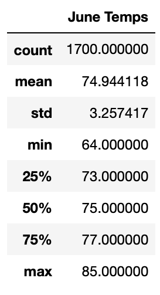
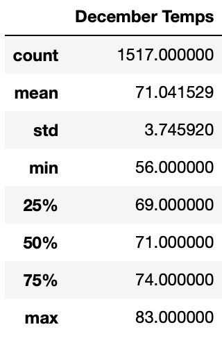
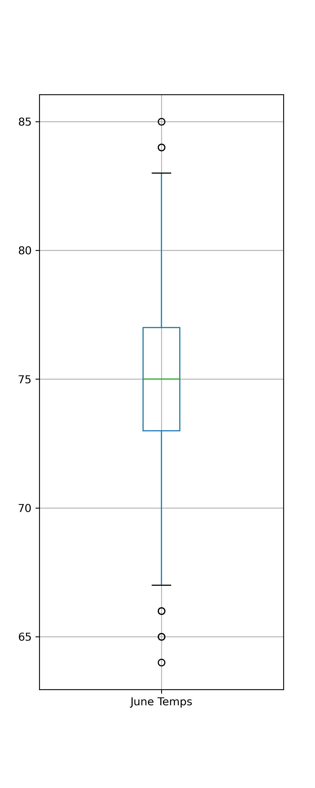
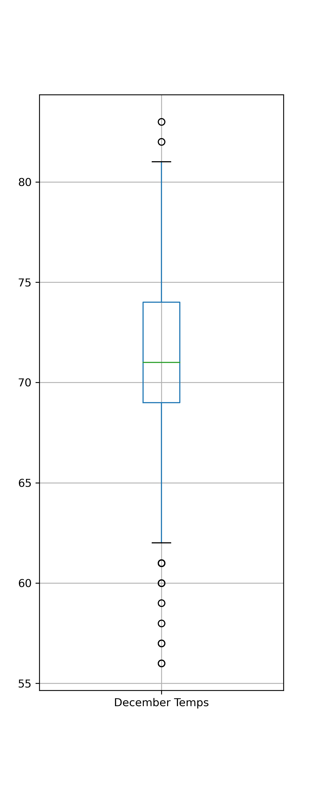
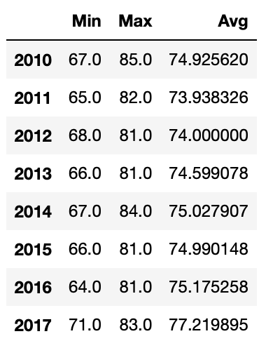

# surfs_up
## Analysis Overview
The Surf’s Up Analysis complies data from sqlite files via python’s sqlalchemy to inform business decisions regarding investment into a brand of ice cream shops on the island of Oahu. In consideration of a potential “off” season, the analysis compares the weather data for the island during the peak summer month of June and heart-of-winter month Decemeber. The underlying assumption of the analysis is that weather is a key consumer factor in the decision to buy ice cream.
## Results
The weather analysis of the study is strong for the area, with 1517 observed temperatures for the December months spanning 7 years (~190 observations/December) and 1700 observed temperatures for the June months spanning 8 years (~212 observations/June). Initial observations do not break the temperatures up by year, but this is provided in the summary as well as potential extensions if more data regarding the temperatures is needed for analysis. Below are reported key observations in the two months’ temperature readings followed by appropriate visualizations.    

* December is statistically significantly colder than June on the island. (This is backed by a paired t-test with a significance level of less than 0.0001.)
* Additionally, December has greater variance in temperature, essentially meaning more sporadic, less consistent than in June. This could indicate that it would be harder to pin down a projected revenue for the month of December to prepare for any assumed temperature-related dip.
* While the statistics indicate that December is significantly colder than June, overall, the months temperatures are not so far apart in degree as to be alarming to potential consumers. They do not seem too different as to say that one is viable and the other is definitely not. 
  
   

<table><tr>
<td>  </td>
<td>  </td>
</tr></table> 

<table><tr>
<td>  </td>
<td>  </td>
</tr></table>

## Summary
This analysis considers only the weather as an indicator for success or failure of a potential investment. With that in mind, the analysis concludes while December’s average temperature is, statistically-speaking, significantly colder than January (by 3 degrees), it is not a deal-breaker as far as the shop’s appeal is concerned. The primary concern, however, is the greater variance in December temperatures that could make the month more difficult to predict than June, and thus, harder to prepare for.    
The analysis suggests and ran the following queries to clarify the behavior of these observed temperatures. Visualizations are provided and an extension is offered depending on the depth of comparison desired. 

* How do the minimum, maximum, and average recorded temperatures change over the years provided in the database for June, and for December? 

The results of these 2 queries were transformed into two data frames for viewing and for further analyses. The June results are on the left and December results are on the right. The code is included in the challenge notebook.    

  

  

 

### Extended: Further Analysis 
To further actualize the information provided in the above data frames, it could be a useful analysis to depict the information in scatterplots or compare the years’ temperatures by box plots to immediately see how the variance of temperature is different per year.   
Additionally, it could be insightful to query the database to pull the information from Junes and Decembers from specific stations nearest to where shops are considered. 